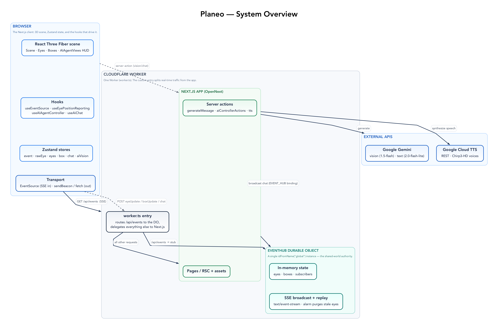
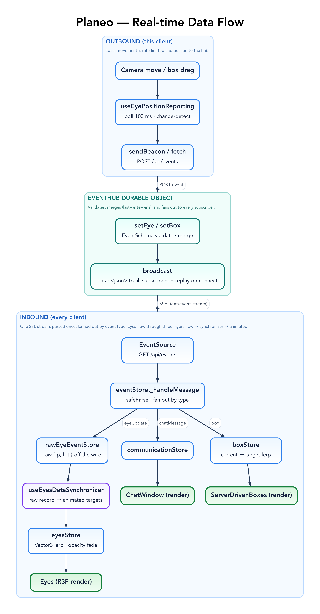
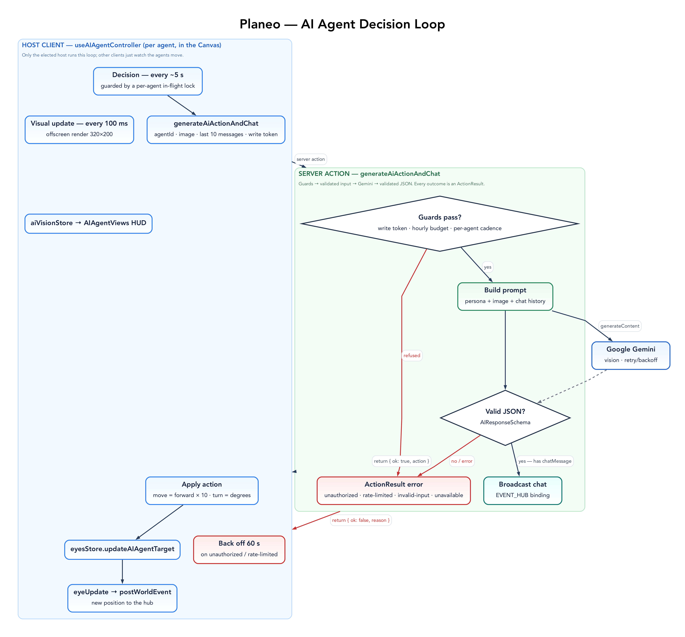
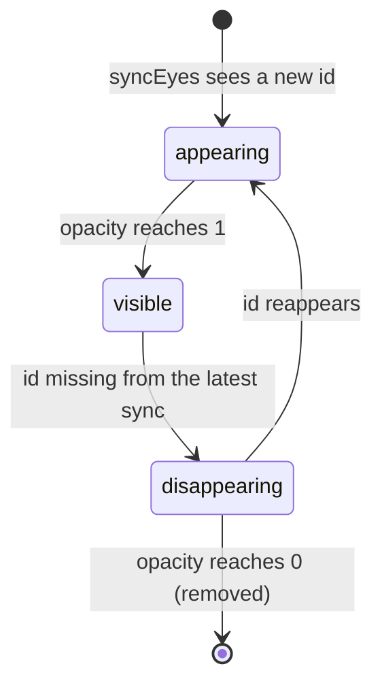

# Architecture

Planeo is an interactive 3D web app where a human user and AI agents share one
space. The user walks a first-person camera around a 3D world (React Three
Fiber + Rapier physics); AI agents are rendered as floating eyeballs that see
the scene from their own viewpoint, decide how to move, and chat. Everyone's
positions, the AI chat, and the physics cubes are synced between browsers over
Server-Sent Events (SSE).

This document is the comprehensive technical reference for how the running
system fits together. For known gaps and planned work see
[`docs/BACKLOG.md`](docs/BACKLOG.md); for the contributor/agent workflow see
[`AGENTS.md`](AGENTS.md).

## The one thing that shapes everything: a single Durable Object authority

All cross-client state lives in **one Durable Object**, the `EventHub` in
[`src/server/eventHub.ts`](src/server/eventHub.ts). The Worker always resolves it
by the same name (`idFromName("global")`), so there is exactly one instance, and
it is the single authority for the shared world: every connected client's eye,
the physics boxes, and the set of open SSE connections. That state is held in
plain instance fields (`eyes`, `boxes`, `subs`) — **in-memory and ephemeral**:
no world state is written to storage, so it lives only while the DO is active.
There is no Redis, database, or pub/sub, and none is needed — the Durable Object
**is** the shared-state primitive. A broadcast reaches every subscriber on that
one instance. To run multiple independent worlds you would shard by DO name
(one `idFromName(world)` per world); each is its own isolated authority.

The DO owns the shared _state_, but the _simulation_ that produces it — the AI
agents' decisions and the cubes' physics — runs on exactly one client at a time,
the **host**. The DO elects the oldest connected client as host (each client
supplies a stable `id` on its SSE connection), broadcasts a `host` event whenever
that changes, and re-elects on disconnect. Only the host drives the agent loop
and simulates the cubes, posting the results back like any other client;
everyone else is a pure viewer. This keeps the expensive, write-heavy work
single-owner instead of every browser redundantly driving — and fighting over —
the same agents and boxes.

## Codebase map

| Path                           | Responsibility                                                                                                                                                                            |
| ------------------------------ | ----------------------------------------------------------------------------------------------------------------------------------------------------------------------------------------- |
| `src/app/layout.tsx`           | Root layout: fonts, metadata, PWA manifest. No providers.                                                                                                                                 |
| `src/app/page.tsx`             | `HomePage` client component. Mints a per-client `myId` (`nanoid(6)`), mounts the scene + chat UI, starts the text-chat and eye-sync hooks.                                                |
| `src/app/components/Scene.tsx` | React Three Fiber host: opens the SSE connection, gates on the start overlay, owns the human camera and keyboard controls, renders the world.                                             |
| `src/app/components/`          | Scene-level R3F components: `Eye`/`Eyes` (agents + users), `Box` (physics cubes), `AIAgentViews` (HUD thumbnails), `StartOverlay`.                                                        |
| `src/components/`              | DOM chat UI: `ChatWindow`, `ChatMessage`, `ChatInput`.                                                                                                                                    |
| `src/hooks/`                   | `useEventSource` (SSE in), `useEyePositionReporting` (position out), `useEyesDataSynchronizer`, `useAIAgentController` (agent vision + decisions; host only), `useAiChat` (text replies). |
| `src/app/actions/`             | Server actions: `generateMessage.ts` (AI vision/action/chat), `aiControllerActions.ts` (`requestAiDecision` wrapper), `tts.ts` (Google Cloud TTS via REST).                               |
| `src/server/eventHub.ts`       | The `EventHub` Durable Object: the single real-time authority (eyes, boxes, open SSE connections) and the SSE endpoint handler.                                                           |
| `worker.ts`                    | Custom Worker entry: re-exports `EventHub`, routes `/api/events` to the DO, delegates everything else to the Next.js app.                                                                 |
| `src/lib/`                     | `googleAI.ts` (Gemini client + model selection), `googleAuth.ts` (Web Crypto OAuth), `log.ts` (structured logger), `retry.ts`, `exposeStore.ts`.                                          |
| `src/stores/`                  | Zustand stores (see below).                                                                                                                                                               |
| `src/domain/`                  | Zod schemas and shared constants (the data contracts).                                                                                                                                    |
| `wrangler.jsonc`               | Worker config: `main = worker.ts`, the `EVENT_HUB` Durable Object binding + migration, non-secret `vars`.                                                                                 |
| `open-next.config.ts`          | `@opennextjs/cloudflare` adapter config (default in-memory cache).                                                                                                                        |

## Patterns

Planeo is built from a small set of recurring patterns; naming them is the
fastest way to understand the code and the standard to hold new code to. Where
the code does not yet follow a pattern consistently, and patterns worth adopting,
are tracked in [`docs/BACKLOG.md`](docs/BACKLOG.md#pattern-consistency--gaps).

### Data & contracts

- **Schema is the source of truth.** Every domain type is `z.infer<typeof Schema>` —
  no hand-written parallel types. [`src/domain/`](src/domain/).
- **Tagged unions for variants.** Wire events and AI actions are discriminated
  unions keyed on `type`, giving exhaustive narrowing on both ends (`EventSchema`
  in `event.ts`, `AIActionSchema` in `aiAction.ts`).
- **Parse at the boundary.** Untrusted input is `safeParse`d where it enters the
  system and rejected on failure: the DO `POST`, the SSE message on the client,
  the LLM's JSON output, parsed secrets and config.
- **The LLM's output is a schema.** The model must return JSON matching
  `AIResponseSchema`; the raw text is fence-stripped, parsed, validated, and
  dropped if invalid (`generateMessage.ts`).
- **Refinements for cross-field rules.** Invariants like "at least one of `p`/`l`"
  live in a `.refine()`d schema, not handler code (`ValidatedEyeUpdatePayloadSchema`,
  `ValidatedBoxUpdatePayloadSchema`).
- **Compose + share.** Event schemas `.extend()` a base entity; shared magic
  numbers live in one `sceneConstants` module imported by both client and DO.

### Real-time & server

- **One Durable Object is the authority.** A single `idFromName("global")`
  instance owns all shared state; clients never hold authority.
- **Single simulation host.** The DO elects the oldest connected client as the
  one that runs the AI-agent loop and the cube physics, broadcasting a `host`
  event on change; every other client renders the broadcast results as a viewer.
- **Custom Worker entry: route-one, delegate-rest.** `worker.ts` forwards
  `/api/events` to the DO and hands everything else to the Next.js app.
- **Broadcast / subscribe with state replay.** A new SSE subscriber is registered,
  replayed the full current world, then fed live deltas; cleanup is driven by the
  request abort signal.
- **Last-write-wins partial merge.** `setEye`/`setBox` merge incoming fields over
  existing state (`p ?? existing?.p`), then store and broadcast a complete message.
- **Self-rescheduling alarm.** The DO's `alarm()` does periodic housekeeping
  (purge stale eyes) and only re-arms while there is something to maintain.
- **`"use server"` actions are the only server entry points** besides the DO's
  `/api/events`; clients call them directly.
- **Bindings via `getCloudflareContext().env`.** Server actions reach the DO
  through the binding; the DO reads config from its injected `env` param.
- **Lazy singleton clients.** External clients/credentials are created once and
  cached (the Gemini client; the OAuth token, cached with an expiry).
- **Workers-native crypto.** Google auth is REST + Web Crypto (RS256), never the
  gRPC `@google-cloud/*` SDKs (which don't run on Workers).
- **Best-effort broadcast.** Broadcast and stream-write failures are caught and
  dropped, never thrown, so one dead client can't break the loop.
- **The host paces the agent loop.** The ~5 s cadence between agent decisions is
  a client-side interval in the host's `useFrame`, not a server-side sleep — the
  vision action returns as soon as Gemini does.
- **Wrangler-bundled code imports relatively.** The DO is bundled by Wrangler, not
  Next, so it imports domain schemas from specific files via relative paths —
  never `@/…` or any module that reads `process.env` at load.

### Client state & rendering

- **Zustand + immer stores**, one per concern ([`src/stores/`](src/stores/)).
- **Three-layer eye pipeline.** Network truth (`rawEyeEventStore`) → a synchronizer
  hook (`useEyesDataSynchronizer`) → animated render state (`eyesStore`); raw data
  and render/animation state never mix.
- **Store-as-animation-engine.** Stores expose `update*Animations(delta)` that lerp
  current→target; a component `useFrame` just calls it (`boxStore`, `eyesStore`).
- **Optimistic local update + server reconcile.** Local actions mutate immediately;
  the authoritative SSE echo overwrites later (and your own echo is dropped).
- **Rate-limited egress.** Outbound updates are throttled / change-detected /
  interval-batched and sent via `navigator.sendBeacon` (`useEyePositionReporting`,
  `eventStore.sendBoxUpdate`, `Box.tsx` thresholds).
- **Listener registry.** `eventStore` exposes `subscribe*` returning an unsubscribe
  closure; new subscribers get a state replay.
- **Hooks are side-effect controllers.** `use*` hooks render nothing; they own the
  subscriptions, intervals, and frame loops, wired at the top of `page.tsx`/`Scene.tsx`.
- **Refs mirror the store** for per-frame, non-reactive objects (rigid bodies,
  render targets) so frame code never triggers re-renders.

### Cross-cutting

- **Determinism over stored state.** Stable mappings come from hashing inputs, not
  stored assignments (per-user TTS voice, per-box color).
- **Env-gated debug handles.** Stores attach to `window.__store` only outside
  production (or under `NEXT_PUBLIC_E2E`).
- **One technical reference.** This `ARCHITECTURE.md` is the comprehensive
  overview; `docs/BACKLOG.md` tracks gaps and forward work, and
  `AGENTS.md`/`CLAUDE.md` cover the workflow. Per-feature prose is folded in here
  rather than scattered across docs that drift out of sync with the code.

## Render & input

[`Scene.tsx`](src/app/components/Scene.tsx) opens the SSE connection via
`useEventSource`, then gates rendering on `useSimulationStore(isStarted)`. Until
the user clicks the `StartOverlay`, nothing renders — the gate exists so the
browser's autoplay policy will allow audio once interaction begins. After start
it mounts a `<Canvas>` (camera at `[48, 20, 120]`, `fov 75`, `near 1`,
`far 2500`, `preserveDrawingBuffer: true`) wrapping `<Physics>`, the world
content, and the server-driven cubes, plus an `AIAgentViews` HUD.

`CanvasContent` owns the human's first-person camera: WASD/QE/arrow-key controls
(no mouse-look), integrated each frame with lerped velocity (`moveSpeed = 12`,
`acceleration = 0.05`, `dampingFactor = 0.9`, `rotationSpeedFactor = 0.5`).
Rotation is yaw-only and the camera's Y is locked to `EYE_Y_POSITION` (-11.9).

## Real-time layer (SSE)

The [`EventHub`](src/server/eventHub.ts) Durable Object both holds the world
state and serves the SSE endpoint. [`worker.ts`](worker.ts) is the Worker entry:
it routes `/api/events` straight to the one DO stub (`idFromName("global")`) and
delegates every other request to the Next.js app. The DO's `fetch` handles two
methods:

- **`GET /api/events?id=<clientId>`** opens an SSE stream (`text/event-stream`).
  On connect it initializes the boxes once, seeds the configured AI agents' eye
  positions (`agents.slice(0, TOTAL_AGENTS)`, spread along X), registers the
  writer as a subscriber keyed by `clientId`, (re-)elects the host, and replays
  the current eyes, boxes, and current host to the new client.
- **`POST /api/events`** validates the body against `EventSchema` and dispatches:
  `eyeUpdate → setEye`, `chatMessage → broadcast`, `boxUpdate → setBox`.

Inside the DO, `eyes`, `boxes`, and `subs` are in-memory collections; `broadcast`
writes `data:<json>\n\n` to every live subscriber; `setBox` preserves a box's
color across updates; a recurring DO `alarm` (every 10 s) runs `purgeStale`,
which drops eyes idle for more than 30 s. The oldest subscriber is the elected
`host`; adding or dropping a subscriber re-elects, and on a change the DO
broadcasts a `host` event. Boxes are created once from
`NUMBER_OF_BOXES` at positions `[i*15 - (N-1)*7.5, 5, -20]` with colors cycled
from a 12-entry palette.

On the client, `useEventSource` opens `EventSource("/api/events?id=<myId>")`,
`safeParse`s each message, and fans out: `eyeUpdate → rawEyeEventStore`,
`chatMessage`/`box` to registered listeners, and `host → eventStore.hostId`
(which gates the agent loop and the cube physics). `useEyePositionReporting` polls the camera every 100 ms
and sends an `eyeUpdate` (via `navigator.sendBeacon`) when the rounded
position/look changed, or at least every 20 s. `useEyesDataSynchronizer` maps
raw eye records into the animated `eyesStore` for rendering.

### Wire protocol

| `type`        | Direction       | Payload                                                    |
| ------------- | --------------- | ---------------------------------------------------------- |
| `eyeUpdate`   | both            | `id`, `name?`, `p?` (position), `l?` (lookAt), `t`         |
| `chatMessage` | both            | a `Message` (`id`, `userId`, `name?`, `text`, `timestamp`) |
| `box`         | server → client | `id`, `p`, `o` (orientation), `c` (color), `t`             |
| `boxUpdate`   | client → server | `id`, `p?`, `o?` (drives `setBox`)                         |
| `host`        | server → client | `hostId` (the elected simulation host's client id)         |

### Physics

The world runs one Rapier `<Physics>` simulation. The cubes are simulated on the
**host** only: there each box is a `dynamic` rigid body, and
[`Box.tsx`](src/app/components/Box.tsx) transmits its pose (change-detected,
rounded) as `boxUpdate` events. On every other client the same boxes are
`kinematicPosition` bodies that follow the `box` events the host produces (lerped
toward the target by `boxStore.updateBoxAnimations`). The `RigidBody` is keyed on
the host/viewer role, so it cleanly remounts with the right body type when the
host changes. Eyes (users and agents) are `kinematicPosition` bodies with a
`BallCollider` (radius `EYE_RADIUS`): driven by input/AI rather than gravity, but
able to nudge the dynamic cubes.

Each cube also shows a piece of art on one randomly chosen face (the other five
keep the box color). The image and face are picked once per client with
`Math.random()` from a fixed set under [`public/art/`](public/art/) (Met Museum
Open Access, served locally) and held in `useState` — so, unlike the
server-authoritative color, the art is **not** synced across clients.

## AI agents

Agents default to **Orion** (`ai-agent-1`) and **Nova** (`ai-agent-2`), or
whatever `AI_AGENTS_CONFIG` defines ([`src/domain/aiAgent.ts`](src/domain/aiAgent.ts)).
Two Gemini models back them, both via the `@google/genai` client keyed by
`GOOGLE_AI_API_KEY` ([`src/lib/googleAI.ts`](src/lib/googleAI.ts)):

- **Vision/action:** `gemini-3.1-flash-lite` (override with `GOOGLE_VISION_MODEL`)
- **Text chat:** `gemini-3.1-flash-lite` (override with `GOOGLE_TEXT_MODEL`)

### Vision + movement loop

[`useAIAgentController`](src/hooks/useAIAgentController.ts) runs inside the
Canvas, but its frame loop only does work on the elected **host** (the `hostId`
from `eventStore` equals this client's id); on every other client it
early-returns, so each agent is driven exactly once. For each agent (other than
the local user) it allocates an offscreen `PerspectiveCamera` and a `320×200`
`WebGLRenderTarget`. On the host a single `useFrame` drives two cadences:

- **Visual update** every `100 ms` (~10 FPS): render the scene from the agent's
  eye, read + vertically flip the pixels into a PNG data URL, and push it to
  `aiVisionStore` for the HUD thumbnail.
- **Decision** every `~5 s` (the agent-loop rate limiter), guarded by a per-agent
  in-flight lock: send the latest thumbnail and the last 10 chat messages to the
  `requestAiDecision` server action, then apply the returned action locally —
  `move` translates along the forward vector by `distance × 10`; `turn` rotates
  the look-at about Y by `degrees`. The new position is reported back over SSE.

[`generateAiActionAndChat`](src/app/actions/generateMessage.ts) is the server
side: it builds the agent's "newly-awakened, disoriented" persona prompt, calls
Gemini with `responseMimeType: "application/json"` (`temperature 0.4`,
`maxOutputTokens 256`), strips code fences, and validates the result against
`AIResponseSchema` (`{ chatMessage?, action }`). If there's a chat message it
broadcasts it to the `EventHub` DO via the `EVENT_HUB` binding
(`getCloudflareContext().env`) and returns the action. Pacing is the host's job:
the `~5 s` cadence lives in `useAIAgentController`'s frame loop, so the action
returns as soon as Gemini does.

### Text chat replies

[`useAiChat`](src/hooks/useAiChat.ts) (page-level) watches the chat. When the
most recent message is from the human user, after a `1500–2500 ms` delay it asks
**only the first agent** to reply via `generateAiChatMessage` (text-only) and
broadcasts the result. The pending reply is keyed to the human message id, so
agent chatter arriving in the meantime doesn't cancel it.

## Audio / TTS

[`tts.ts`](src/app/actions/tts.ts) `synthesizeSpeechAction` is real Google Cloud
TTS, called over the **REST API** (`texttospeech.googleapis.com`). Auth is an
OAuth access token minted from the `GOOGLE_APP_CREDS_JSON` service-account key
with the Web Crypto API (RS256) in [`googleAuth.ts`](src/lib/googleAuth.ts) — the
gRPC `@google-cloud/*` client cannot run on the Workers runtime. It
deterministically assigns each `userId` one of 24 Chirp3-HD voices (by hash),
synthesizes MP3, and returns base64.
[`ChatMessage.tsx`](src/components/ChatMessage.tsx) calls it client-side for each
incoming message (skipping the user's own and `/`-commands) and plays the audio.
Disabled when `NEXT_PUBLIC_TTS_ENABLED` is exactly `"false"`.

## State (Zustand stores)

| Store                | Holds                                                                                                                   |
| -------------------- | ----------------------------------------------------------------------------------------------------------------------- |
| `communicationStore` | Chat messages + chat-UI flags (`isChatVisible`, input focus).                                                           |
| `eventStore`         | The `EventSource` connection, listener registries, and outbound senders (`sendChatMessage`, throttled `sendBoxUpdate`). |
| `rawEyeEventStore`   | Raw per-id eye records (`p`, `l`, `t`) straight off SSE.                                                                |
| `eyesStore`          | The rendered/animated eyes (Three `Vector3`/`ShaderMaterial`, opacity, scale, proximity-based conversation pairing).    |
| `boxStore`           | Animated cube state (current/target position + orientation, color), lerped each frame.                                  |
| `aiVisionStore`      | The latest agent-view thumbnails for the HUD.                                                                           |
| `simulationStore`    | The single `isStarted` flag behind the start overlay.                                                                   |

### Eye lifecycle

Each eye (a user or agent) animates through a small state machine in `eyesStore`
— fading in on arrival, fading out when its updates stop:

## Domain schemas

[`src/domain/`](src/domain/) holds the Zod contracts: `aiAction` (the
`move`/`turn`/`none` action union and the `AIResponse` the vision model must
return — `turn` is clamped to 1–45°), `message`, `event` (the SSE union),
`eye`, `box`, `aiAgent` (config parsing + defaults), plus `sceneConstants`
(`EYE_RADIUS 8`, `EYE_Y_POSITION -11.9`, ground at -20) and `common`
(`Vec3Schema`).

## Configuration

Secrets (`GOOGLE_AI_API_KEY`, `GOOGLE_APP_CREDS_JSON`) are set with
`wrangler secret put <NAME>` (or `.dev.vars` locally, copied from
[`.dev.vars.example`](.dev.vars.example)). The non-secret world config lives in
[`wrangler.jsonc`](wrangler.jsonc) `vars`. `NEXT_PUBLIC_TTS_ENABLED` is
build-time (inlined by Next).

| Variable                        | Required | Purpose                                                                | Set via          | Default                 |
| ------------------------------- | -------- | ---------------------------------------------------------------------- | ---------------- | ----------------------- |
| `GOOGLE_AI_API_KEY`             | for AI   | Gemini client (text + vision).                                         | secret           | —                       |
| `GOOGLE_APP_CREDS_JSON`         | for TTS  | Google Cloud service-account JSON for Chirp3 TTS.                      | secret           | —                       |
| `AI_AGENTS_CONFIG`              | no       | JSON array of `{ id, displayName }` agents.                            | `wrangler.jsonc` | Orion + Nova            |
| `TOTAL_AGENTS`                  | no       | How many agents get eye positions.                                     | `wrangler.jsonc` | `0`                     |
| `NUMBER_OF_BOXES`               | no       | Physics cubes to spawn.                                                | `wrangler.jsonc` | `5`                     |
| `NEXT_PUBLIC_TTS_ENABLED`       | no       | Set to `"false"` to disable TTS.                                       | build-time env   | enabled                 |
| `GOOGLE_TEXT_MODEL`             | no       | Gemini model for text chat.                                            | secret/env       | `gemini-3.1-flash-lite` |
| `GOOGLE_VISION_MODEL`           | no       | Gemini model for the vision/action loop.                               | secret/env       | `gemini-3.1-flash-lite` |
| `WORLD_WRITE_TOKEN`             | no       | Write gate: only bearers may POST events or invoke the Gemini actions. | secret           | open world              |
| `NEXT_PUBLIC_WORLD_WRITE_TOKEN` | no       | The same token, inlined into trusted-writer client builds.             | build-time env   | —                       |
| `RATE_LIMIT_AI_HOURLY`          | no       | Rolling one-hour budget for the billable Gemini actions (per isolate). | secret/env       | `2000`                  |
| `RATE_LIMIT_TTS_HOURLY`         | no       | Rolling one-hour budget for TTS synthesis (per isolate).               | secret/env       | `240`                   |

### Cost & write protection

Server actions are anonymous POST RPCs, so the billable surfaces carry their
own guards ([`src/lib/aiGuard.ts`](src/lib/aiGuard.ts),
[`src/lib/worldAuth.ts`](src/lib/worldAuth.ts)):

- With `WORLD_WRITE_TOKEN` set, the `EventHub` POST surface and the Gemini
  actions require the bearer token; clients built with
  `NEXT_PUBLIC_WORLD_WRITE_TOKEN` present it (via `postWorldEvent`, which falls
  back from `sendBeacon` to a keepalive `fetch` because beacons cannot carry
  the `Authorization` header). Everyone else is a read-only spectator.
- Rolling one-hour budgets cap Gemini (`RATE_LIMIT_AI_HOURLY`) and TTS
  (`RATE_LIMIT_TTS_HOURLY`) calls regardless of auth — in-memory
  circuit-breakers, exact on a single server and best-effort per isolate on
  Workers. TTS additionally allowlists voice names to the Chirp3 set.

## Build & deploy

The app runs on **Cloudflare Workers** via the
[`@opennextjs/cloudflare`](https://opennext.js.org/cloudflare) adapter.
[`open-next.config.ts`](open-next.config.ts) configures the adapter and
[`wrangler.jsonc`](wrangler.jsonc) the Worker — `main` is
[`worker.ts`](worker.ts), with the `EVENT_HUB` Durable Object binding plus its
`new_sqlite_classes` migration and the non-secret `vars`.

- `npm run dev` — Next.js dev server (Turbopack, <http://localhost:3000>). It
  serves the UI only; the real-time hub at `/api/events` lives in `worker.ts`
  and the DO, which `next dev` does not run.
- `npm run preview` — `opennextjs-cloudflare build && opennextjs-cloudflare preview`.
  Runs the full Workers runtime locally, **including** the `EventHub` DO. Use
  this to exercise real-time behavior.
- `npm run deploy` — `opennextjs-cloudflare build && opennextjs-cloudflare deploy`.
- `npm run cf-typegen` — `wrangler types`; rerun after editing `wrangler.jsonc`.

CI is [`.github/workflows/ci.yml`](.github/workflows/ci.yml): a `check` job
(`npm run verify`) gates every push and PR, and a `deploy` job builds with
OpenNext and ships to Cloudflare via
[`cloudflare/wrangler-action`](https://github.com/cloudflare/wrangler-action) on
push to `main`. Auto-deploy is gated behind the `DEPLOY_ENABLED` repo variable,
currently unset — so the app is **not currently deployed**. Set it to `true`
(`gh variable set DEPLOY_ENABLED --body true`), with the `CLOUDFLARE_API_TOKEN`
and `CLOUDFLARE_ACCOUNT_ID` secrets, to re-enable. The `planeo.tre.systems`
custom domain is already configured in [`wrangler.jsonc`](wrangler.jsonc)
(`routes`) and takes effect once deployed.
